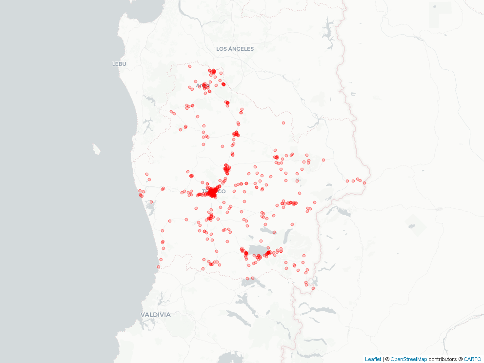

```{r Librerías/Pquetes, include = FALSE}
source("Scripts/CargarLibrerias.R", encoding = "UTF-8")
windowsFonts("Arial" = windowsFont("Calibri"))
```

```{r Definir Regiones, include=FALSE}
source("Scripts/Reg.R", encoding = "UTF-8")
reg <- as.character(reg3[reg3$reg2 == params$reg, 1]) # esto facilita la impresión masiva de reportes
```

---
title: Minuta `r reg`
date: `r format(Sys.Date(), "%d/%m/%Y")`
---

```{r opciones de cada chunk de código, echo=FALSE}
knitr::opts_chunk$set(echo = FALSE, message=FALSE, warning=FALSE, dpi=300)
```

```{r Cargar Datos}
source("Scripts/CargaDatos.R", encoding = "UTF-8")
```

```{r Datos: UF}
source("Scripts/ManejoDatos_UF.R", encoding = "UTF-8")
```

```{r Datos: FDC}
source("Scripts/ManejoDatos_FDC.R", encoding = "UTF-8")
```

```{r Gráficos}
source("Scripts/Graficos.R", encoding = "UTF-8")
```

```{r Mapa}
source("Scripts/Mapa.R", encoding = "UTF-8")
```


# 1. Sobre la información presentada [^1]

###### A continuación, se presenta una ejemplo de minuta con diferentes indicadores asociados a la **`r reg`**. Los datos son simulados y no deben ser considerados en ningún caso como información oficial de la SMA. Este reporte fue generado el **`r format(Sys.Date(), "%d/%m/%Y")`**. 

[^1]: **UF**: Unidad Fiscalizable / **RCA**: Resolución de Calificación Ambiental / **IA**: Inspección Ambiental / **PPDA**: Plan de Prevensión y Descontaminación Ambiental / **RSMA**: Resolución de normas e instrucciones de carácter de la Superintendencia de Medio ambiente / **PC/PDC**: Programa de Cumplimiento / **NC**: Norma de Contaminación / **LEY**: Ley Ambiental / **REG**: Reglamento / **NE**: Norma de Emisión / **MP**: Medida Provisional / **FDC**: Formulación de Cargos / **MM**: Millones


# 2. Unidades Fiscalizables

- **`r prettyNum(nrow(UF_reg), big.mark = ".", decimal.mark = ",")`** de las **`r prettyNum(nrow(Resumen_UnidadFiscalizable), big.mark = ".", decimal.mark = ",")`** Unidades Fiscalizables (UF) a nivel nacional corresponden a la **`r reg`** (`r paste0(Porcentaje_uf_reg, "%")`).
- Estas se concentran mayoritariamente en la categoría **`r resumen_cate[1,1]`** (`r resumen_cate[1,2]` UFs), seguida por la **`r resumen_cate[2,1]`** (`r resumen_cate[2,2]` UFs)

## 2.1 Localización UFs en la `r reg`

```{r Mapa UFs, out.width="400px", fig.align="center"}

```

## 2.2 Distribución de UFs a nivel nacional

```{r Gráfico: UFs por región, fig.width=6, fig.height=3, fig.align="center"}
uf_reg
```

## 2.3 UFs de la `r reg` por sector

```{r Gráfico: UFs por categoría económica, fig.width=6, fig.height=2.8, fig.align="center"}
uf_cat
```

## 2.4 Las 5 Categorías Económicas de `r reg` con más RCA

```{r Gráfico: top 5 UF RCA, fig.width=6, fig.height=3, fig.align="center"}
top_RCA %>% 
  flextable() %>% 
  width(j = c(1, 2), width = c(1.8, 1)) %>% 
  font(fontname = "Calibri", part = "all") %>% 
  fontsize(size = 10, part = "all")
```

# 3. Formulaciones de cargo

## 6.1 Formulaciones de cargo (FDC)

* La `r reg` ocupa el lugar `r filter(FDC_reg_porcentaje, Region == reg)$rank` respecto al resto de las regiones en número de FdC.
* De **`r prettyNum(Comparar[1,2] + Comparar[2,2], big.mark = ".", decimal.mark = ",")`** FdC, **`r Comparar[1,2]`** (**`r paste0(prettyNum(round(Comparar[1,2]/(Comparar[1,2] + Comparar[2,2])*100,1), big.mark = ".", decimal.mark = ","),"%")`**) han sido en la **`r reg`**. 
* Dentro de la **`r reg`**, `r prettyNum(round(FDC_origen$FDC[FDC_origen$ProcesoSancionTipoNombre == "Denuncia"]/sum(FDC_origen$FDC)*100,1), big.mark = ".", decimal.mark = ",")`% de las FdC fueron iniciadas a partir de **denuncias**.
* **`r MAX_cate$CategoriaEconomica[1]`** es el sector que concentra el mayor número de FdC en la `r reg` (`r MAX_cate$FDC[1]`) seguida por **`r MAX_cate$CategoriaEconomica[2]`** (`r MAX_cate$FDC[2]`).

### FDC por región

```{r Gráfico: FDC categoría, fig.width=7, fig.height=3.2, fig.align="center"}
FDC_reg_porcentaje %>%
  ggplot(aes(reorder(Region, orden_reg), Porcentaje, label = paste0(prettyNum(Porcentaje, big.mark = ".", decimal.mark = ","), "%", " (", prettyNum(FDC, big.mark = ".", decimal.mark = ","), ")"), fill = Destacar)) + 
  geom_col() +
  ylim(0, max(FDC_reg_porcentaje$Porcentaje)*1.25) + 
  coord_flip() +
  geom_text(hjust = -0.22, size = 3) +
  scale_fill_manual(values = c("Si" = "#E87474", "No" = "light blue", "Si2" = "light gray")) + 
  theme(panel.background = element_rect(fill = NA),
        legend.position = "none",
        plot.title = element_text(hjust = 0.5),
        axis.title.x = element_blank(),
        axis.title.y = element_blank(),
        axis.ticks.x = element_blank(),
        axis.ticks.y = element_blank(),
        axis.text.x = element_blank(),
        text = element_text(family = "Calibri"))
```

### FDC asociadas a la `r reg` por año

```{r Gráfico: FDC Año, fig.width=4.8, fig.height=2, fig.align="center"}
fdc_anio
```

### Distribución de FDC asociadas a la `r reg` por sector

```{r Gráfico FDC región, fig.width=6, fig.height=3, fig.align="center"}
fdc_cat
```

### FDC asociadas a la `r reg` por origen

```{r Gráfico FDC Origen, fig.width=3.3, fig.height=2.2, fig.align="center"}
fdc_origen
```

### FDC asociadas a la `r reg` por estado

```{r Gráfico FDC Estado, fig.width=3.3, fig.height=2.2, fig.align="center"}
fdc_estado
```