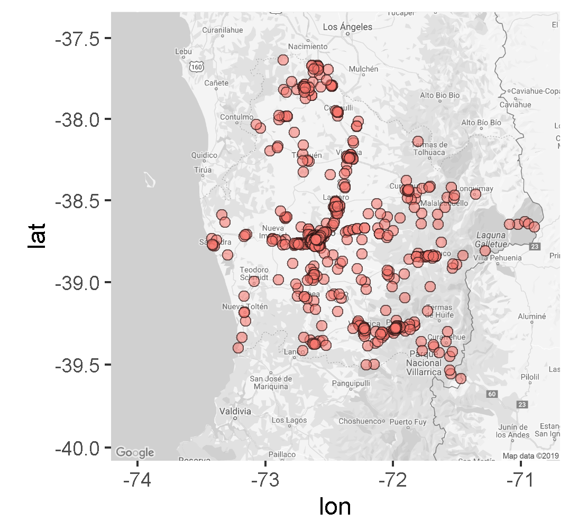
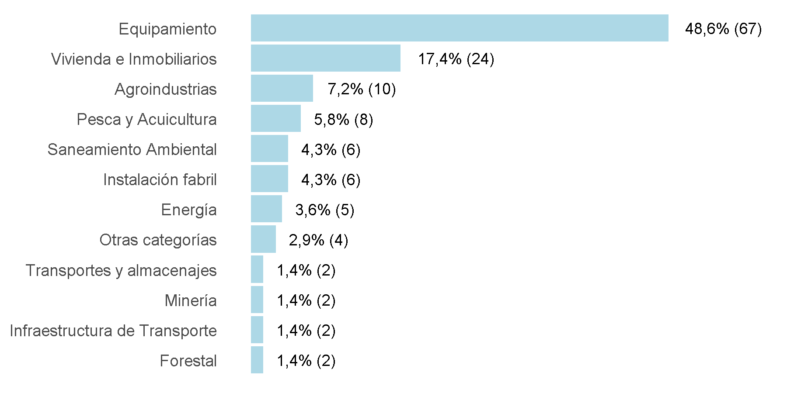
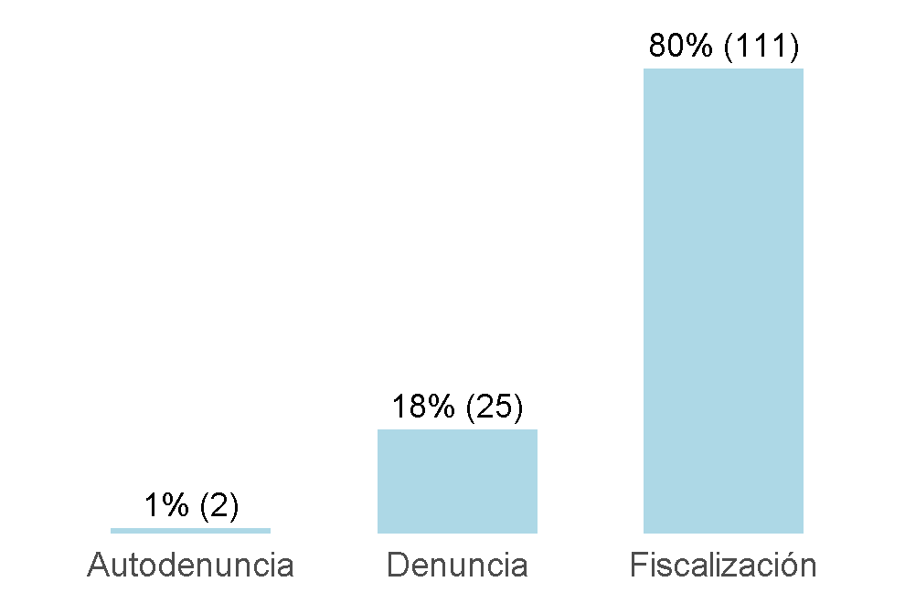

---
title: Minuta Región de la Araucanía
date: 23/11/2019
---

# 1. Sobre la información presentada [^1]

###### A continuación, se presenta una minuta con diferentes indicadores asociados a la **Región de la Araucanía**. Los datos son recopilados a partir de los diferentes sistemas de información disponibles de la Superintendencia del Medio Ambiente y consideran la información actualizada al **23/11/2019**. 

[^1]: **UF**: Unidad Fiscalizable / **RCA**: Resolución de Calificación Ambiental / **IA**: Inspección Ambiental / **PPDA**: Plan de Prevensión y Descontaminación Ambiental / **RSMA**: Resolución de normas e instrucciones de carácter de la Superintendencia de Medio ambiente / **PC/PDC**: Programa de Cumplimiento / **NC**: Norma de Contaminación / **LEY**: Ley Ambiental / **REG**: Reglamento / **NE**: Norma de Emisión / **MP**: Medida Provisional / **FDC**: Formulación de Cargos / **MM**: Millones

# 2. Unidades Fiscalizables

- **879** de las **15.773** Unidades Fiscalizables (UF) a nivel nacional corresponden a la **Región de la Araucanía** (5.6%).
- Estas se concentran mayoritariamente en la categoría **Equipamiento** (226 UFs), seguida por la **Vivienda e Inmobiliarios** (163 UFs)

## 2.1 Localización UFs en la Región de la Araucanía

## 2.2 Distribución de UFs a nivel nacional

## 2.3 UFs de la Región de la Araucanía por sector

## 2.4 Las 5 Categorías Económicas de Región de la Araucanía con más RCA

|CategoriaEconomicaNombre | RCAs|
|:------------------------|----:|
|Saneamiento Ambiental    |  107|
|Pesca y Acuicultura      |  104|
|Vivienda e Inmobiliarios |   66|
|Equipamiento             |   58|
|Energía                  |   49|

# 3. Formulaciones de cargo

## 6.1 Formulaciones de cargo (FDC)

* La Región de la Araucanía ocupa el lugar 2 respecto al resto de las regiones en número de FdC.
* De **951** FdC, **138** (**14,5%**) han sido en la **Región de la Araucanía**. 
* Dentro de la **Región de la Araucanía**, 18,1% de las FdC fueron iniciadas a partir de **denuncias**.
* **Equipamiento** es el sector que concentra el mayor número de FdC en la Región de la Araucanía (67) seguida por **Vivienda e Inmobiliarios** (24).

### FDC por región

### FDC asociadas a la Región de la Araucanía por año

### Distribución de FDC asociadas a la Región de la Araucanía por sector

### FDC asociadas a la Región de la Araucanía por origen

### FDC asociadas a la Región de la Araucanía por estado

